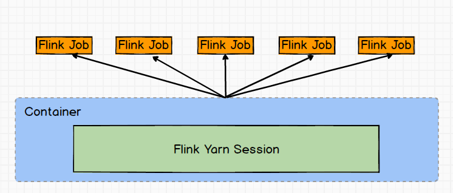
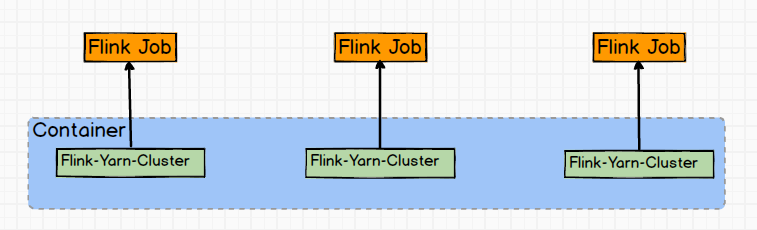

# 1. Flink初始
## 1.1 Flink简介
Flink是一个低延迟、高吞吐、统一的大数据计算引擎，Flink的计算平台可以实现毫秒级的延迟情况下，每秒钟处理上亿次的消息或者事件。
同时Flink提供了一个Exactly-once的一致性语义。保证了数据的正确性。这样就使得Flink大数据引擎可以提供金融级的数据处理能力。
Flink作为主攻流计算的大数据引擎，它区别于Storm，Spark, Streaming以及其他流式计算引擎的是:它不仅是一个高吞吐，低延迟的计算引擎，同时还提供
很多高级的功能。比如它提供了有状态的计算，支持状态管理，支持强一致性的数据语义以及支持Event Time，WaterMark对消息乱序的处理。
## 1.2 发展历程
## 1.3 为什么要学Flink？
Flink最区别于其他流计算引擎的，其实就是stateful，即有状态计算。Flink提供了内置的对状态的一致性的处理，即如果任务发生了Failover，其状态不会丢失、不会
被多算少算，同时提供了非常高的性能。
什么是状态？例如开发一套流计算的系统或者任务做数据处理，可能经常要对数据进行统计，如Sum，Count，Min，Max这些值是需要存储的。因为要不断更新，
这些值或者变量就可以理解为一种状态。如果数据源是在读Kafka，RocketMQ，可能要记录读取到什么位置，并记录offset，这些offset变量都是要计算的状态。
Flink提供了内置的状态管理，可以把这些状态存储在Flink内部，而不需要把它存储在外部系统。这样做的好处是第一降低了计算引擎对外部系统的依赖以及部署，使运维
更加简单;第二，对性能带来了极大的提升;如果通过外部去访问，例如Redis，Base 他一定是通过网络及RPC。如果通过Flink内部去访问，它只通过自身的进程去访问这些
变量。同时Flink会定期将这些状态做CheckPoint持久化，把CheckPoint存储到一个分布式的存储系统中，比如HDFS。这样的话，当Flink的任务出现任何故障时，他都会从
最近的一次Checkpoint将整个流的转态进行恢复，然后继续运行它的流处理。对用户没有任何数据上的影响。
# 2. 走进FLink的世界
## 2.1 Flink是什么？
Apache Flink是一个分布式计算引擎，用于对无界和有界数据流进行状态计算。Flink可以在所有常见的集群环境中运行，并且能够对任何规模的数据
进行计算。这里的规模指的是既能批量处理(批计算)也能一条一条的处理(流计算)。
无界和有界数据:
Flink认为任何类型的数据都是作为事件流产生的。比如: 信用卡交易，传感器测量，机器日志或网站移动应用程序，所有这些数据可以作为无界或者有界流处理:
无界流：它有开始事件但是没有截止时间，他们在生成时提供数据，但不会被终止。无界流必须连续处理数据，即必须在摄取事件后立即处理事件。他无法等待所有
输入数据到达，因为输入是无界的，如果是这样，在任何时间点都无法完成。处理无界数据通常要求以特定顺序摄取事件，例如事件发生的顺序，以便能够推断结果
完整性。
有界流：具有起始时间和截止时间。它可以在执行任何的计算之前，先通过摄取所有数据后再来处理有界流。处理有界流不需要有序摄取，因为可以对有界数据集进行排序。
有界流的处理也称为批处理

## 2.4 Flink中的key
Flink处理数据不是K,V格式编程模型，没有xxByKey算子，它是虚拟的key
Flink中Java Api编程中的Tuple需要使用Flink中的Tuple，最多支持25个
批处理用groupBy算子，流失处理用keyBy算子
Apache Flink指定虚拟key
使用Tuples来指定key
使用Field Expression指定key
使用key selector functions来指定key

# 3 DataStream Operator
## 3.1 DataStream Source
### 3.1.1 基于文件
readTextFile(path) 读取text文件的数据
readFile(fileInputFormat,path) 通过自定义的读取方式，来读取文件的数据
### 3.1.2 基于socket
scoketTextStream 从socket端口中读取数据
### 3.1.3 基于集合
fromCollection(Collection) 从collection集合里读取数据，从而形成一个数据流，即合理的元素类型需要一致
fromElements(T...) 从数组中读取数据，从而形成一个数据流，集合里的元素类型需要一致
generateSequence(from,to) 创建一个数据流，数据源里的数据从from到to的数字
### 3.1.4 自定义source
addSource 自定义一个数据源，比如FlinkKafkaConsumer，从kafka里读取数据

## 3.2 DataStream TransFormations
转换算子                                      描述
map   DataStream -> DataStream              采用一个元素并生成一个元素
flatMap   DataStream -> DataStream          一个元素并生成零个，一个或多个元素
filter    DataStream -> DataStream          过滤函数返回false的数据，true的数据保留
keyBy     DataStream -> KeyedStream         指定key将k，v格式的数据流进行逻辑分区，将相同key的记录分在同一个分区里
aggregation   KeyedStream -> DataStream     对k，v格式的数据流进行聚合操作 keyedStream.sum(0);keyedStream.sum("key");
reduce   KeyedStream -> DataStream          对k，v的数据进行“减少操作”，这个操作逻辑自己写

## 3.3 DataStream sink
writeAstext()  将计算结果输出成text文件
writeAsCsv()   将计算结果输出成csv文件
print()        将计算结果打印到控制台
writeUsingOutputFormat()  自定义输出方式
writeToSocket  将计算结果输出到某台机器的端口上

Job Manager  Task Manager Clients
Flink运行时包含了两种类型的处理器
JobManager(也称之为master)：用于协调分布式执行。他们用来调度task，协调调查点，协调失败恢复等
Flink运行时至少存在一个JobManager。一个高可用的运行模式会存在多个JobManager，他们其中有一个是leader，而其他的都是standBy
Taskmanager(也称为worker)：用于执行一个dataFlow的task(或者特殊的subtask)、数据缓冲和dateStream的交换
Flink运行时至少会存在一个TaskManager
TaskManager连接到JobManager，告知自身的可用性进而获得任务分配
客户端不是运行时和程序执行的一部分。但它用于准备并发送dataFlow给master，然后客户端断开连接或者维持连接以等待接收计算结果

flink standalone
1.下载flink包，并上传解压
2.配置conf/flink-conf.yaml文件
env.java.home jdk环境变量
jobmanager.rpc.address jobmanager地址
jobmanager.heap.mb jobmanager进程内存
taskmanager.heap.mb taskmanager的进程内存
taskmanager.numberOfTaskSlots taskmanager的task slot个数 一个slot对应一个并行度任务
parallelism.default 用户默认的任务执行并行度
3.配置conf/slaves文件
node1
node2
node3
4.将配置好的flink拷贝到其他节点上
5.启动集群
/bin/start-cluster.sh
6.访问flink集群的webui界面
http://jobmanager_id:8081

Flink on yarn  
(1) Session-Cluster  
  

Session-Cluster模式需要先启动集群，然后再提交作业，接着会向yarn申请一块空间后，资源永远保持不变。
如果资源满了，下一个作业就无法提交，只能等到yarn中的其中一个作业执行完成后，释放了资源，下个作业才会正常提交。
所有作业共享Dispatcher和ResourceManager：共享资源；适合规模小执行时间短的作业。  
在yarn中初始化一个flink集群，开辟指定的资源，以后提交任务都向这里提交。这个flink集群会常驻在yarn集群中，除非手工停止。

Session-Cluster  
(1)启动hadoop集群
(2)启动yarn-session
./yarn-session.sh -n 2 -s 2 -jm 1024 -tm 1024 -nm test -d  
其中；  
-n(--container)； TaskManager的数量。  
-s(--slots)； 每个TaskManager的slot数量，默认一个slot一个core，默认每个taskManager的
slot个数为1，有时可以多一些taskManager，做冗余。  
-jm；JobManager的内存 (单位MB)。
-tm；每个taskManager的内存 (单位MB)。
-nm；yarn的appName
-d；后台执行

(2) Per-Job-Cluster  
  
一个Job会对应一个集群，每提交一个作业会根据自身的情况，都会单独向yarn申请资源，直到作业执行完成，
一个作业的失败与否并不会影响下一个作业的正常提交和运行。独享Dispatcher和
ResourceManager，按需接受资源申请；适合规模大长时间运行的作业  
每次提交都会创建一个心的flink集群，任务之间相互独立，互不影响，方便管理。任务执行完成之后创建的集群也会消失。  

./flink run -m yarn-cluster -c com.demo.StreamWordCount xxx.jar

# 3 FLink 流处理简介

WaterMark(水印)
我们知道，流处理从事件产生，到数据流经source，再到operator，中间是有一个过程和时间的。虽然大部分情况下，数据流到operator的数据都是按照事件
产生的时间顺序来的，但是也不排除由于网络、背压等原因，导致乱序的产生(out-of-order或者说late element)
但是对于late element(延迟数据),我们又不能无限期的等下去，必须要有个机制来保证一个特定的时间后，必须触发window去进行计算了。这个特别的机制，就是watermark

watermark介绍
watermark是Flink为了处理EventTime时间类型的窗口计算提出的一种机制，本质上也是一种时间戳，Watermark是用于处理乱序事件的，而正确的处理乱序事件，通常用
watermark机制结合window来实现
当operator通过基于EventTime的时间窗口来处理数据时，它必须在确定所有属于该时间窗口的消息全部流入此操作符后，才能开始处理数据。但是由于消息可能是乱序的，
所以opeartor无法直接确认何时所有属于该时间窗口的消息全部流入此操作符。Watermark包含一个时间戳，Flink使用Watermark标记所有小于该时间戳的消息都已流
入，Flink的数据源在确认所有小于某个时间戳的消息都已输出到Flink流处理系统后，会生成一个包含该时间戳的Watermark，插入到消息流中输出到Flink流处理系统中，
Flink operator算子按照时间窗口缓存所有流入的消息，当操作符处理到WaterMark时，它对所有小于该WaterMark时间戳的时间窗口的数据进行处理并发送到下一个操
作符节点，然后将Watermark发送到下一个操作符节点。

